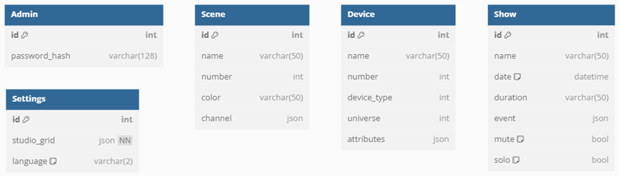

# Datenbank

Der Server verfügt über eine SQLite-Datenbank "database.db", die die folgenden Tabellen enthält:



Wichtig sind hier das Admin-Passwort, die gespeicherten Szenen und die Lampenkonfigurationen (Device).
Die Tabellen für die Settings und die Show waren zwar geplant, werden aber bisher nicht verwendet.

## Backup der Datenbank

Die Datenbank kann einfach gesichert werden, indem die Datei "database.db" kopiert wird. Diese Datei kann dann auf einem anderen Server oder Computer wiederhergestellt werden. Um die Datenbank zu kopieren, navigiert man auf dem Raspberry Pi in das Verzeichnis, in dem sich die Datei befindet,

luminos@luminos:~ $ cd /home/luminos/backend/server/database.db ???????

und führt den folgenden Befehl aus:

```bash
cp database.db database_backup.db
```

bullshit, man kriegt es nicht runter lol

## Wiederherstellen der Datenbank

Um die Datenbank wiederherzustellen

## Löschen/Zurücksetzen der Datenbank
